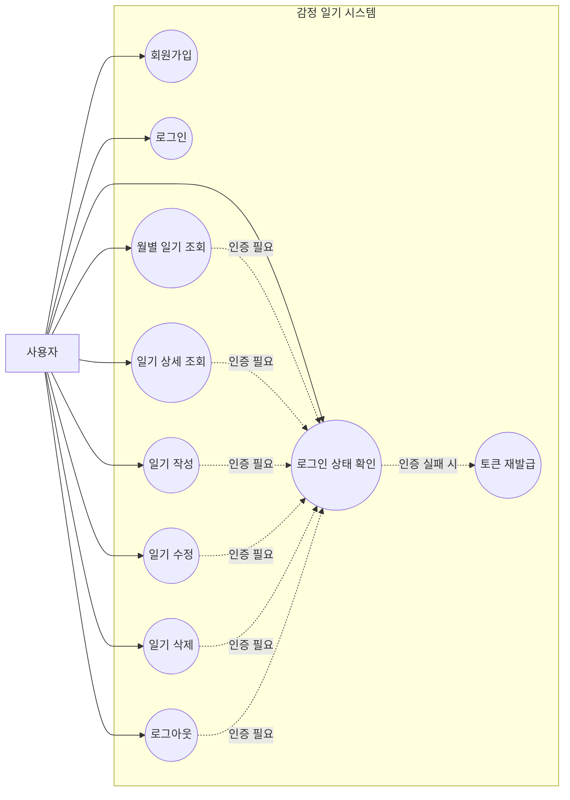
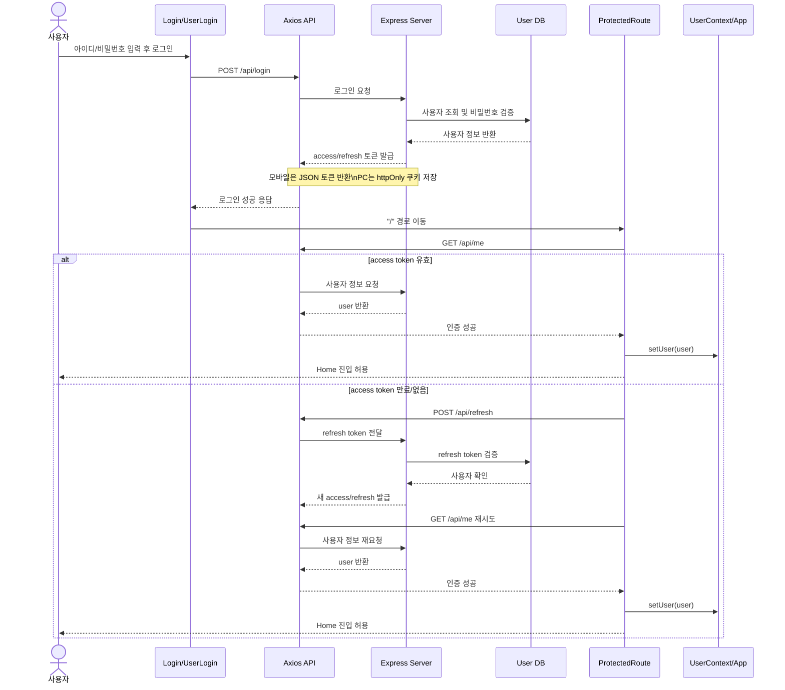
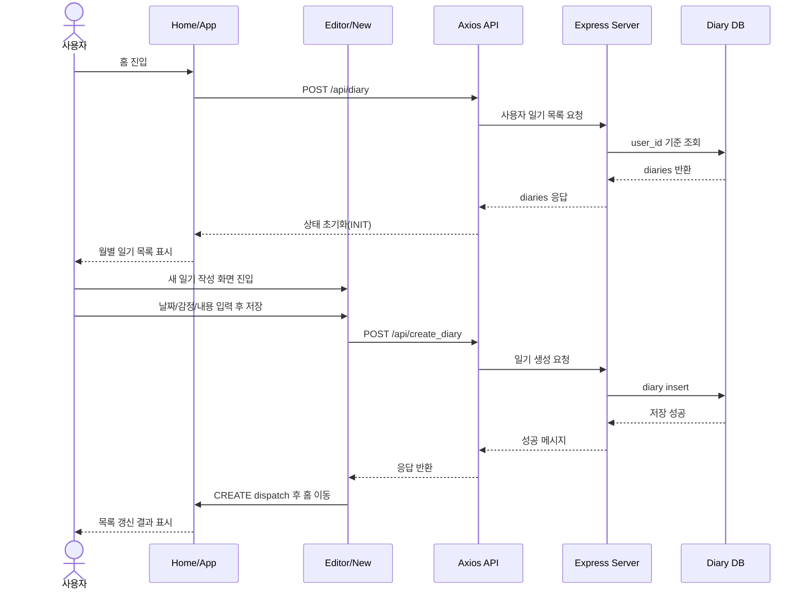
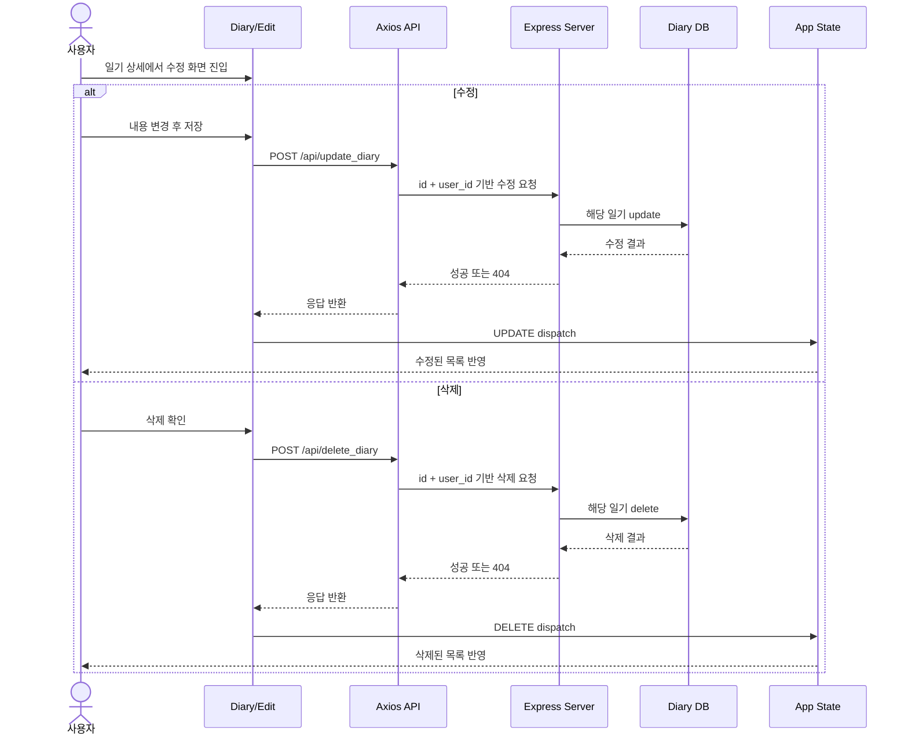
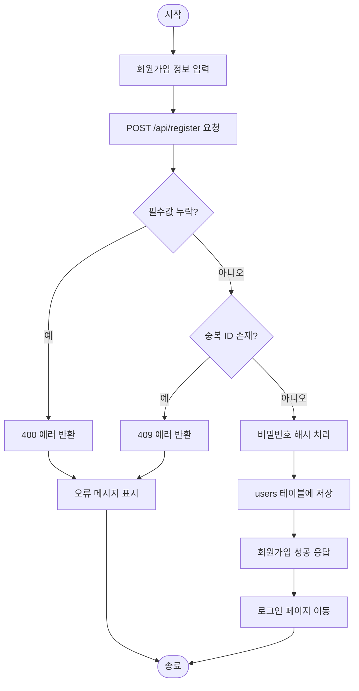

# 프로젝트 다이어그램

## 1. 유스케이스 다이어그램



## 2. 시퀀스 다이어그램

### 2-1. 로그인과 보호 라우트 진입



### 2-2. 일기 작성/조회 흐름



### 2-3. 일기 수정/삭제 흐름



## 3. 활동 다이어그램

### 3-1. 인증 기반 서비스 이용 활동

```mermaid
flowchart TD
    A([시작]) --> B[사용자가 보호 페이지 접근]
    B --> C[ProtectedRoute에서 /api/me 호출]
    C --> D{access token 유효?}

    D -- 예 --> E[UserContext에 사용자 저장]
    E --> F[App에서 /api/diary 호출]
    F --> G[일기 목록 로드]
    G --> H[홈 화면 표시]

    D -- 아니오 --> I[/api/refresh 호출]
    I --> J{refresh token 유효?}
    J -- 예 --> K[새 access/refresh 발급]
    K --> C
    J -- 아니오 --> L[로그인 페이지로 이동]
    L --> M([종료])

    H --> N{사용자 액션 선택}
    N -- 작성 --> O[일기 작성 저장]
    N -- 상세 조회 --> P[일기 상세 보기]
    N -- 수정 --> Q[일기 수정 저장]
    N -- 삭제 --> R[일기 삭제]
    N -- 로그아웃 --> S[토큰 제거 및 사용자 초기화]

    O --> H
    P --> H
    Q --> H
    R --> H
    S --> M
```

### 3-2. 회원가입 활동



PC: `httpOnly cookie`
모바일: `localStorage + Authorization header`
